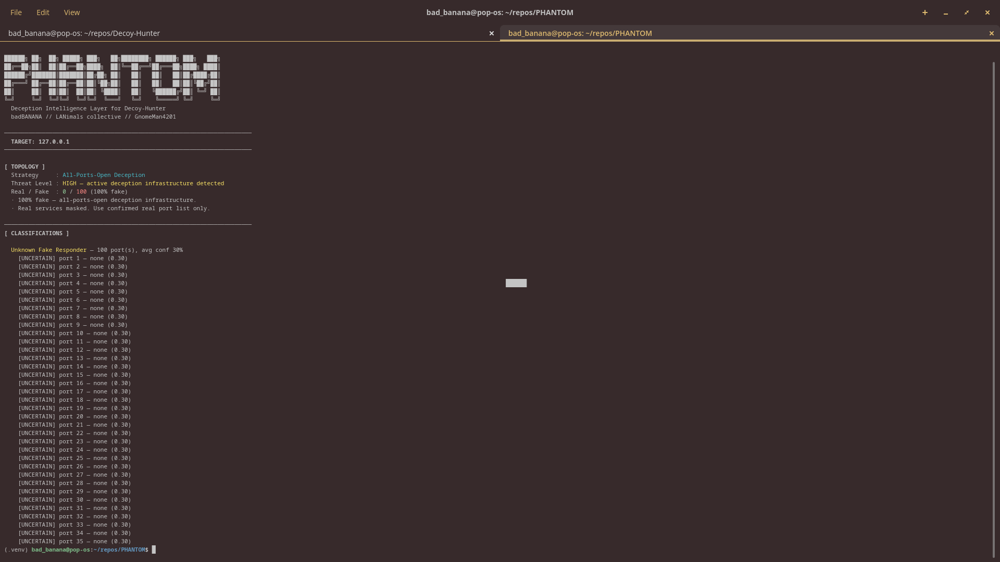

# PHANTOM

Deception intelligence layer for [Decoy-Hunter](https://github.com/GnomeMan4201/Decoy-Hunter).

Decoy-Hunter tells you what's fake. PHANTOM tells you **what kind of fake, why it matters, and what to do about it.**

## What it does

**Honeypot Classifier** — fingerprints fake ports against 19 signatures across Cowrie, Kippo, OpenCanary, Thinkst Canary, HoneyD, Dionaea, Glutton, and s0i37 Defence

**Topology Mapper** — classifies the deception strategy being used against you: all-ports-open, selective honeypot, tarpit, mixed environment, or sparse canary deployment

**Counter-Playbook Engine** — produces an operational playbook: which ports to prioritize, which to avoid, which are canary tripwires. Outputs a LANimals-compatible risk score and tag set.

## Usage

Pipe Decoy-Hunter output directly into PHANTOM:
```bash
python3 decoy_hunter.py 192.168.1.10 -p 1-10000 | python3 phantom_cli.py --host 192.168.1.10
```

From a saved scan file:
```bash
python3 phantom_cli.py --host 192.168.1.10 --input scan.txt
```

JSON output for scripting or LANimals integration:
```bash
python3 phantom_cli.py --host 192.168.1.10 --input scan.txt --json > report.json
```

## Output
```
[ TOPOLOGY ]
  Strategy     : All-Ports-Open Deception
  Threat Level : HIGH — active deception infrastructure detected
  Real / Fake  : 2 real / 847 fake (99% fake)

[ CLASSIFICATIONS ]
  Cowrie — 3 ports, avg conf 90%
    [HIGH-CONFIDENCE DECOY] port 22 — cowrie-ssh-default (0.97)

[ PLAYBOOK ]
  Approach: Mass deception active. Use confirmed real port list only.
  Prioritize : [80, 443]
  Avoid      : [22, 23, 21, ...]
  Canary Risk: none
  LANimals Risk : 0.93
```

## Decoy-Hunter plugin

Copy `plugin_integration/phantom/` into your Decoy-Hunter `plugin_integration/` directory. PHANTOM auto-discovers its own path.

## Stack

Pure Python 3.10+ — no dependencies beyond the standard library and pytest for tests.

## Tests
```bash
python3 -m pytest tests/ -v
```

20 tests, 0 dependencies.

---

*builds on [toxy4any/Decoy-Hunter](https://github.com/toxy4ny/Decoy-Hunter) and [s0i37/defence](https://github.com/s0i37/defence)*

*LANimals collective // badBANANA // GnomeMan4201*

---

## Demo

<p align="center">
  
</p>
